# GSD-T Workflow Diagram

Visual reference for every GSD-T command and how they connect. Generated 2026-05-08, GSD-T v3.24.10.

**Visual language** (consistent across all 6 diagrams):

| Shape / Color | Role |
|---|---|
| 🟦 Blue rectangle | GSD-T command |
| 🟪 Dashed purple rectangle | Auto-spawned subagent (qa, doc-ripple, debug-loop) |
| 🟥 Red rectangle | Quality gate (Red Team, Design Verify) |
| 🟧 Amber diamond | Decision point |
| 🟫 Pink hexagon | Smart router (`/gsd`) |
| ⬜ Oval | User input / output endpoint |
| 🟨 Cylinder | File / artifact |
| **Solid arrow** | Typical successor / auto-advance |
| **Dashed arrow** | Optional or conditional path / spawn |

The PNGs are rendered from D2 sources alongside each diagram. The Mermaid source is kept below each PNG as a fallback for environments that auto-render Mermaid (GitHub markdown).

To regenerate after editing a `.d2` source:
```sh
cd docs/diagrams
d2 --layout=elk --pad=40 NN-name.d2 NN-name.svg
# Then convert to PNG via headless Chrome (D2's native PNG export needs Playwright)
```

---

## 1. Top-Level Map — Entry Points → Lifecycle

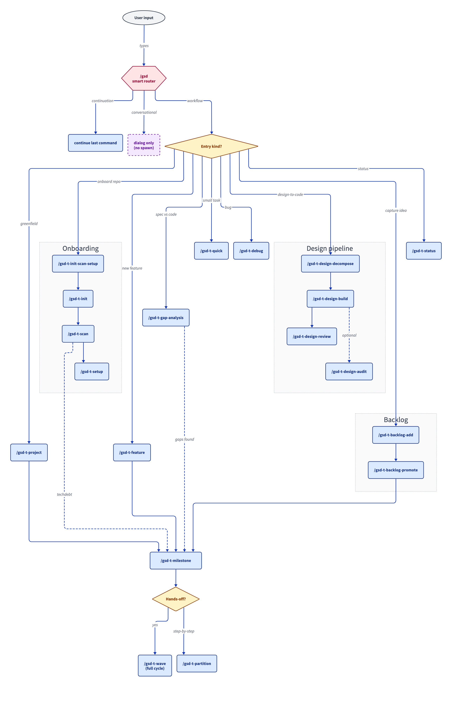

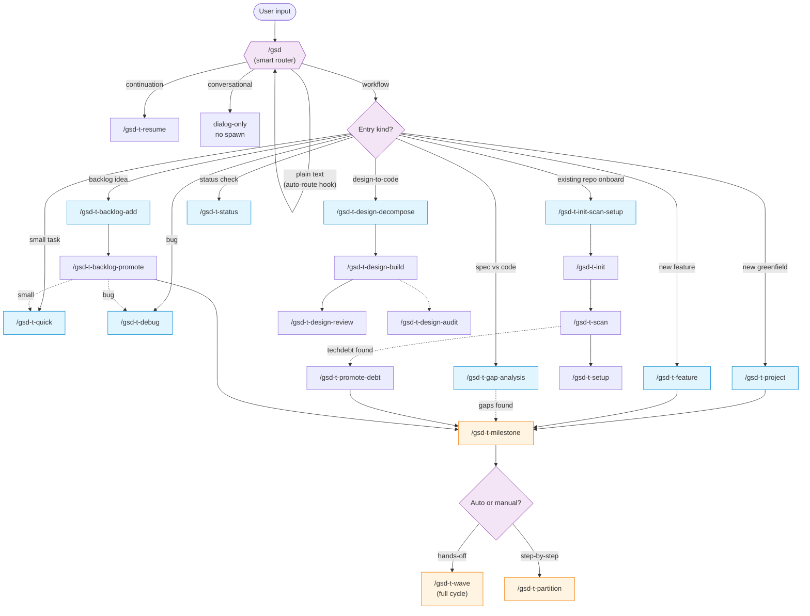

---

## 2. Milestone Lifecycle — The Core Workflow

This is the heart of GSD-T. Every milestone passes through these phases. `/gsd-t-wave` runs them all hands-off; manual mode advances one at a time.

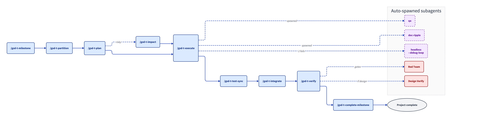

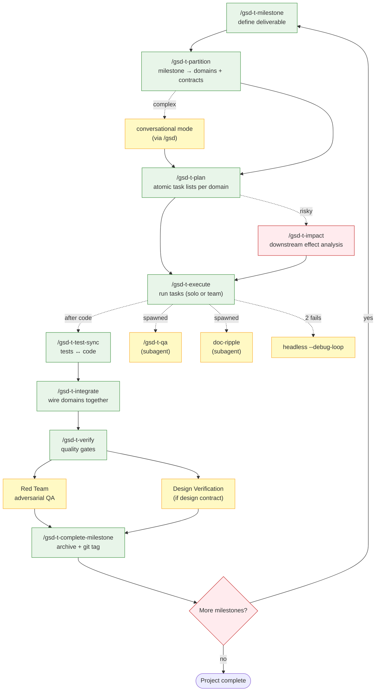

---

## 3. Wave Mode — Hands-Off Full Cycle

`/gsd-t-wave` chains every phase automatically. This is what runs in unattended mode.

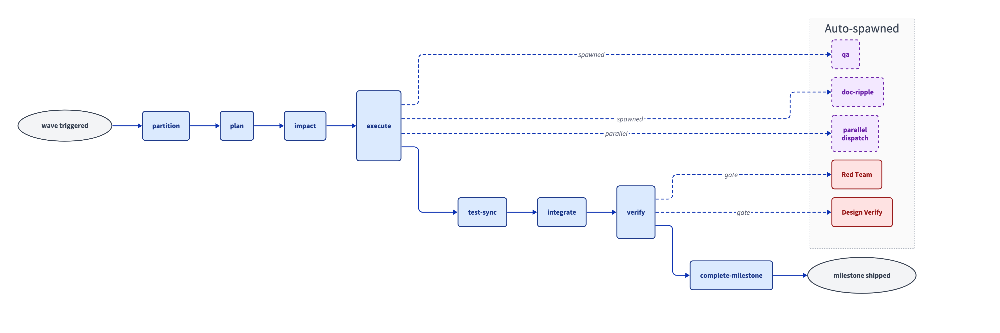

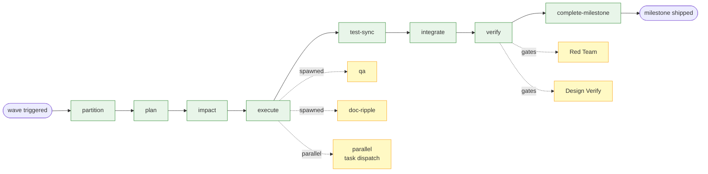

---

## 4. Design-to-Code Pipeline

Triggered when user provides a Figma URL, screenshots, or "build from this design".

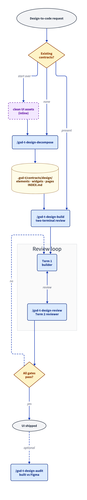

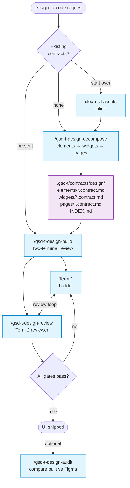

---

## 5. Backlog Subsystem

Lightweight idea capture that feeds into the main workflow.

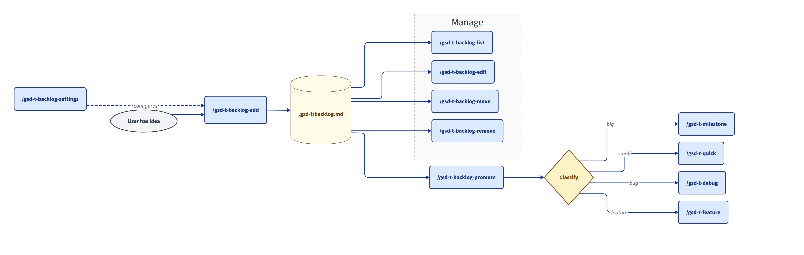

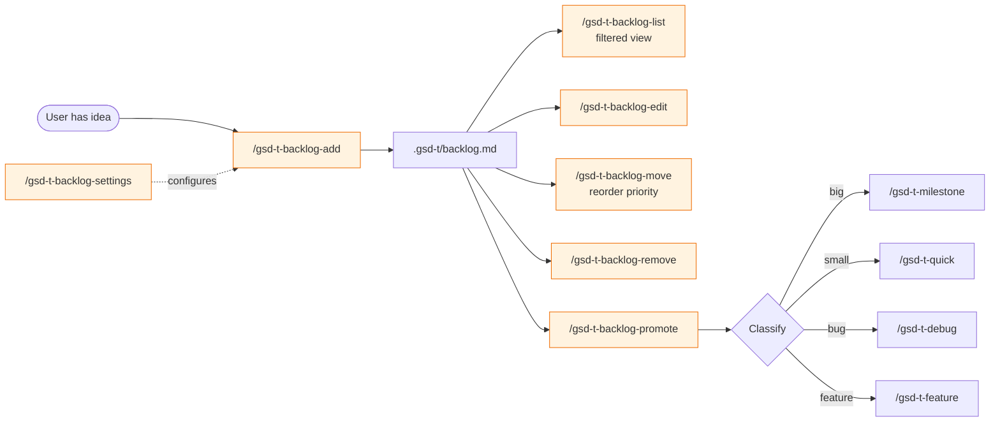

---

## 6. Automation, Observability & Utilities

Commands that operate alongside the main workflow rather than within it.

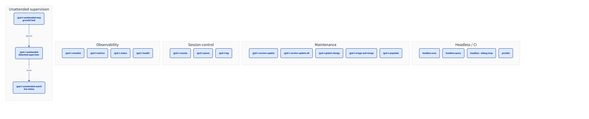

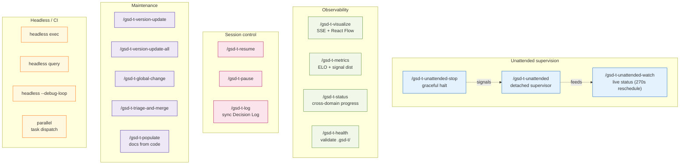

---

## 7. Phase Successor Table

| Completed phase | Auto-advances to | Also available |
|-----------------|------------------|----------------|
| `project` / `feature` | `milestone` | — |
| `init` / `init-scan-setup` | `scan` / `milestone` | `setup` |
| `scan` | `promote-debt` | `milestone` |
| `gap-analysis` | `milestone` | `feature` |
| `milestone` | `partition` | `wave` (full auto) |
| `partition` | `plan` | conversational mode (if complex) |
| `plan` | `execute` | `impact` (if risky) |
| `impact` | `execute` | — |
| `execute` | `test-sync` | spawns `qa`, `doc-ripple` |
| `test-sync` | `verify` | `integrate` (multi-domain) |
| `integrate` | `verify` | — |
| `verify` | `complete-milestone` (auto) | spawns Red Team + Design Verify |
| `complete-milestone` | `status` / next milestone | — |
| `design-decompose` | `design-build` | `partition` (if domains needed) |
| `design-build` | (review loop with `design-review`) | `design-audit` |

Standalone commands (no successor): `quick`, `debug`, `status`, `help`, `resume`, `pause`, `log`, `health`, `metrics`, `visualize`, all `backlog-*`, `version-update*`, `global-change`, `triage-and-merge`, `populate`, `unattended*`.

---

## 8. Auto-Spawned Subagents

These never need manual invocation — they fire as part of code-producing phases:

| Subagent | Spawned by | Purpose |
|----------|------------|---------|
| `qa` | partition, plan, execute, verify, quick, debug, integrate, complete-milestone | Test generation + gap reporting |
| `doc-ripple` | execute, integrate, quick, debug, wave | Update downstream docs |
| Red Team | verify (after QA passes) | Adversarial bug-finding |
| Design Verification | execute Step 5.25, verify (when design contract exists) | Browser-based pixel comparison |
| `headless --debug-loop` | execute, test-sync, verify, debug, wave (after 2 failed fix attempts) | Compaction-proof fix loop |
| `parallel` | execute, wave, integrate, quick, debug (when >1 task passes gates) | Task-level parallel dispatch |

---

## 9. Source

- Canonical command list: `commands/` directory
- Per-command details: `/gsd-t-help {command}` or [commands/gsd-t-help.md](../commands/gsd-t-help.md)
- Command summaries section in help file is the source of truth — this diagram is derived from it.
